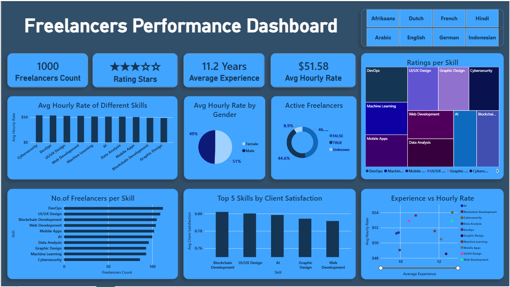

# Freelancer Performance Dashboard

## Project Overview

This project analyzes freelancer data to uncover insights into hourly rates, skills, experience, ratings, client satisfaction, and workforce distribution.

The project demonstrates a complete Data Analytics workflow, starting from raw CSV data, performing data cleaning and preprocessing using Python, analyzing the data using SQL, and creating an interactive Power BI dashboard to visualize key insights.

---

## Tools & Technologies Used

* Microsoft Excel
* Python
* Jupyter Notebook
* SQL
* Power BI
* CSV Files

---

## Project Workflow

### 1. Raw Data Collection

The project begins with a raw freelancer dataset stored in CSV format and reviewed using Microsoft Excel.

### 2. Data Cleaning & Preprocessing

Using Python and Jupyter Notebook, the dataset was cleaned and prepared for analysis. This included handling missing values, validating data, and ensuring consistency across fields.

### 3. Data Analysis

SQL queries were used to answer business-related questions and generate insights regarding freelancer performance, ratings, skills, hourly rates, and experience.

### 4. Dashboard Development

Power BI was used to create an interactive dashboard that presents key metrics and visual insights.

---

## Dashboard Features

### KPI Cards

* Total Freelancers
* Average Rating
* Average Experience
* Average Hourly Rate

### Visualizations

* Average Hourly Rate by Skill
* Average Hourly Rate by Gender
* Active vs Inactive Freelancers
* Number of Freelancers per Skill
* Ratings by Skill
* Top 5 Skills by Client Satisfaction
* Experience vs Hourly Rate Analysis

### Filters

* Language Filter

---

## Key Insights

* DevOps freelancers have the highest average hourly rates.
* Client satisfaction scores remain consistently high across skills.
* Hourly rates are relatively stable among different skill categories.
* Gender-based differences in average hourly rates are minimal.
* More experienced freelancers generally command higher hourly rates.

---

## Project Files

* `freelancers_raw.csv` – Original dataset
* `freelancers_cleaning_code.ipynb` – Data cleaning and preprocessing notebook
* `freelancers_cleaned.csv` – Cleaned dataset used for analysis
* `freelancer_insights.sql` – SQL queries used for analysis
* `freelancers_dashboard.pbix` – Power BI dashboard
* `freelancers_dashboard.png` – Dashboard preview screenshot

---

## Dashboard Preview

---

## Author

**Shreyas Jadhav**

Aspiring Data Analyst skilled in Excel, SQL, Python, and Power BI, passionate about transforming data into actionable insights and building data-driven solutions.

